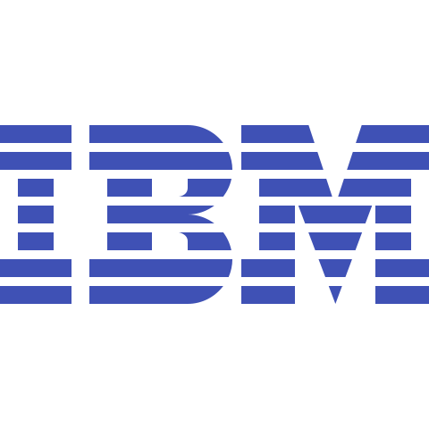

    !👋;Welcome+to+my+profile!;I+am+a+Full+Stack+Developer+💻👾👨‍💻                &font=Fira%20Code&weight=800&size=35&color=6A5ACD&background=E6E6FA&center=true&width=980&height=150&duration=2500&pause=1000" alt="Example Usage - README Typing SVG">

<h3 align="left">🌟 Crafting Digital Symphony with Python, .NET Core, Angular, and React: Turning Code into Art 🎨🚀</h3>

- 🔭 I’m currently working on **Microsoft Sustainability**

- 🌱 I’m currently learning **Django**

- 💬 Ask me about **React, Angular, .Net Core, Power Apps**

- 📫 How to reach me **chodavaramsaibharathreddy@gmail.com**

<h3 align="left">Stay Connected : </h3>

    

<h3 align="left">Techs and Tools : </h3>

    
    
    
    
    
    
    
    
    
    
    
    
    
    

## Licenses & certifications : 

    
 <b>Microsoft Certified: Azure Fundamentals</b>

    
Issued by: <b>Microsoft</b>

    
Credential ID : <b>I522-7659</b>

    
<a href="https://credly.com/badges/8c58ef28-45af-4621-bdeb-340472b5790f"><b>Show Credential</b></a>

    
 <b>Python for Data Science</b>

    
Issued by: <b>IBM</b>

    
Credential ID : <b>7ca34c9d-7ac7-436b-88c5-49769ca99567</b>

    
<a href="https://www.credly.com/badges/7ca34c9d-7ac7-436b-88c5-49769ca99567"><b>Show Credential</b></a>

    
 <b>React JS- Complete Guide for Frontend Web Development</b>

    
Issued by: <b>Udemy</b>

    
Credential ID : <b>UC-14ccc1fa-ffe9-47d8-a3b6-c7b35c696197</b>

    
<a href="https://www.udemy.com/certificate/UC-14ccc1fa-ffe9-47d8-a3b6-c7b35c696197/"><b>Show Credential</b></a>

    
 <b>Modern HTML & CSS</b>

    
Issued by: <b>GUVI Geek Networks, IITM Research Park</b>

    
Credential ID : <b>Z6i3b1E62a1mz048S7</b>

    
<a href="https://www.guvi.in/verify-certificate?id=Z6i3b1E62a1mz048S7"><b>Show Credential</b></a>

    
 <b>JavaScript</b>

    
Issued by: <b>GUVI Geek Networks, IITM Research Park</b>

    
Credential ID : <b>06lw6940O63152jAHB</b>

    
<a href="https://www.guvi.in/verify-certificate?id=06lw6940O63152jAHB"><b>Show Credential</b></a>

    
 <b>Python</b>

    
Issued by: <b>GUVI Geek Networks, IITM Research Park</b>

    
Credential ID : <b>12Ag6a5c817M6t8m09</b>

    
<a href="https://www.guvi.in/verify-certificate?id=12Ag6a5c817M6t8m09"><b>Show Credential</b></a>

    
 <b>MySQL</b>

    
Issued by: <b>GUVI Geek Networks, IITM Research Park</b>

    
Credential ID : <b>K6I2vV42C617k4W76T</b>

    
<a href="https://www.guvi.in/verify-certificate?id=K6I2vV42C617k4W76T"><b>Show Credential</b></a>

    
 <b>Build Responsive Website Using HTML5, CSS3, JS And Bootstrap</b>

    
Issued by: <b>EDUCBA</b>

    
Credential ID : <b>XMOQOWPD3</b>

    
<a href="https://www.educba.com/certificate/?c=XMOQOWPD3"><b>Show Credential</b></a>

    
 <b>TCS iON Career Edge - Young Professional</b>

    
Issued by: <b>Tata Consultancy Services</b>

    
Credential ID : <b>119854-7999289-1016</b>

    
<a href="https://learning.tcsionhub.in/LX/ecertificate/verification"><b>Show Credential</b></a>

    
 <b>Prompt Engineering for Everyone</b>

    
Issued by: <b>Cognitive Class</b>

    
Credential ID : <b>c535aec6f089496e8447487a42078119</b>

    
<a href="https://courses.cognitiveclass.ai/certificates/c535aec6f089496e8447487a42078119"><b>Show Credential</b></a>

    
 <b>ChatGPT & Its Practical Use Cases</b>

    
Issued by: <b>Skillsoft</b>

    
Credential ID : <b>79159671</b>

    
<a href="https://skillsoft.digitalbadges.skillsoft.com/c4f29987-7465-495e-a790-d960da73cd10"><b>Show Credential</b></a>

    
 <b>ChatGPT Prompt Engineering Examples & Use Cases</b>

    
Issued by: <b>Skillsoft</b>

    
Credential ID : <b>79238255</b>

    
<a href="https://skillsoft.digitalbadges.skillsoft.com/d5f67452-a8d0-47e5-9c94-9e918cc41088"><b>Show Credential</b></a>

    
 <b>ChatGPT's Impact on Various Industries</b>

    
Issued by: <b>Skillsoft</b>

    
Credential ID : <b>79219160</b>

    
<a href="https://skillsoft.digitalbadges.skillsoft.com/41185690-3e18-4cfc-b6b2-602e5f9c9bfd"><b>Show Credential</b></a>

    
 <b>Creating Advanced ChatGPT Prompts</b>

    
Issued by: <b>Skillsoft</b>

    
Credential ID : <b>79238034</b>

    
<a href="https://skillsoft.digitalbadges.skillsoft.com/81820971-c829-401c-bc57-2e9b3db313a7"><b>Show Credential</b></a>

    
 <b>Ethical, Privacy, & Intellectual Property Considerations for ChatGPT</b>

    
Issued by: <b>Skillsoft</b>

    
Credential ID : <b>79238149</b>

    
<a href="https://skillsoft.digitalbadges.skillsoft.com/3d91d1f9-7ad8-434c-88c1-2ec1df0abe49"><b>Show Credential</b></a>

    
 <b>The Role of ChatGPT in Shaping Our Future</b>

    
Issued by: <b>Skillsoft</b>

    
Credential ID : <b>79217664</b>

    
<a href="https://skillsoft.digitalbadges.skillsoft.com/4e76e346-377a-47bf-b25a-fe7fc90a780a"><b>Show Credential</b></a>

    

&nbsp;

